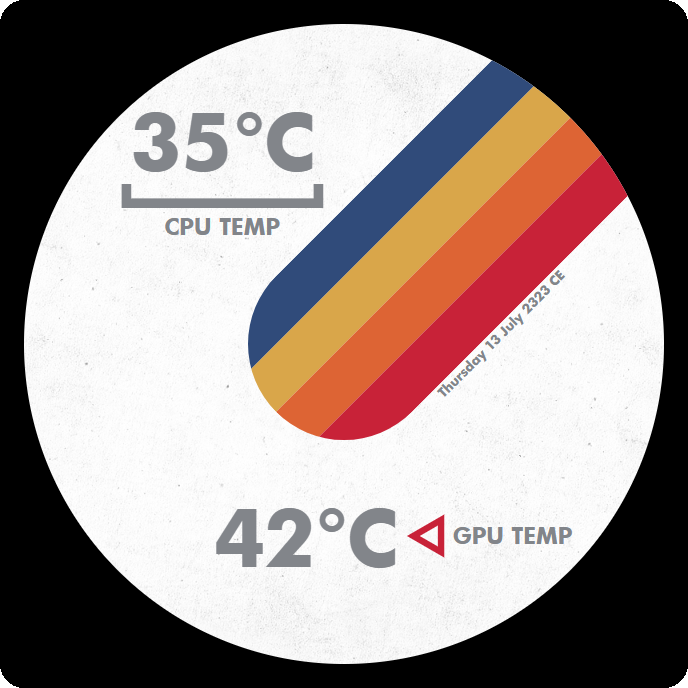

# NZXT Starfield Web Integration by François Mentec

This is a web interface for the NZXT AIO pump screen inpired by the video game Starfield.

The interface show your CPU and GPU temperature and today date plus 300 years, the later is more for style than functionality.

## Quickstart
Paste the following url in NZXT CAM: [https://francoismentec.github.io/NZXT-Starfield-Web-Integration/](https://francoismentec.github.io/NZXT-Starfield-Web-Integration/)

## Installation

1 - Install Node.js  
2 - Clone the repo  
3 - Run `npm install`

Now you can manually start the interface with the command `node index.js`

If you wish to have it start automatically on windows startup simply use the command `node service.js` to create a service.

Use the url [http://127.0.0.1:2553/](http://127.0.0.1:2553/) in NZXT CAM.